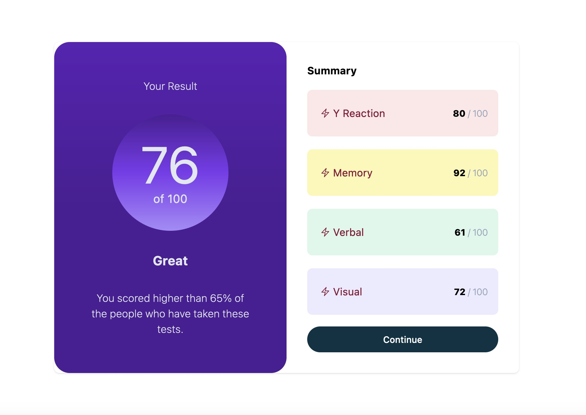

# Frontend Mentor - Results summary component solution

This is a solution to the [Results summary component challenge on Frontend Mentor](https://www.frontendmentor.io/challenges/results-summary-component-CE_K6s0maV). Frontend Mentor challenges help you improve your coding skills by building realistic projects. 

## Table of contents

- [Overview](#overview)
  - [The challenge](#the-challenge)
  - [Screenshot](#screenshot)
  - [Links](#links)
- [My process](#my-process)
  - [Built with](#built-with)
  - [What I learned](#what-i-learned)
  - [Continued development](#continued-development)
  - [Useful resources](#useful-resources)
- [Author](#author)
- [Acknowledgments](#acknowledgments)

**Note: Delete this note and update the table of contents based on what sections you keep.**

## Overview

### The challenge

Users should be able to:

- View the optimal layout for the interface depending on their device's screen size
- See hover and focus states for all interactive elements on the page

### Screenshot



### Links

- [View Project Code](https://github.com/mattrhummel/results-summary-component)
- [Preview Project](https://mattrhummel.github.io/results-summary-component/)

## My process

### Built with

- Semantic HTML5 markup
- TailwindCSS and Flowbite
- Flexbox
- CSS Grid
- Mobile-first workflow
- [TailwindCSS](https://tailwindcss.com/) - A utility-first CSS framework
- [Flowbite](https://flowbite.com/) - Open-source library of over 600+ UI components for TailWind

### What I learned

Use this section to recap over some of your major learnings while working through this project. Writing 


```html
 <ul class="flex flex-wrap flex-row gap-y-5">
                    <li class="w-full p-4 bg-red-100 rounded-lg">    
                      <div class="flex flex-row items-center justify-between py-2">
                        <div  class="flex inline-flex">

                          <div class="p-1 text-rose-900">

                            <svg xmlns="http://www.w3.org/2000/svg" fill="none" viewBox="0 0 24 24" stroke-width="1.5" stroke="currentColor" class="h-4 w-4">
                              <path stroke-linecap="round" stroke-linejoin="round" d="M3.75 13.5l10.5-11.25L12 10.5h8.25L9.75 21.75 12 13.5H3.75z" />
                            </svg>
                            
                      </div>
                      <div class="text-rose-900">
                            Y Reaction
                      </div>
                        </div>
                      <div class="ml-2 text-sm">
                               <span class="font-extrabold"> 80 </span> <span class="text-slate-400 font-extralight">/ 100</span>
                          </div>
                      </div>
                      <li>
                        <li class="w-full p-4 bg-yellow-100 rounded-lg">    
                          <div class="flex flex-row items-center justify-between py-2">
                            <div  class="flex inline-flex">
    
                              <div class="p-1 text-rose-900">
    
                                <svg xmlns="http://www.w3.org/2000/svg" fill="none" viewBox="0 0 24 24" stroke-width="1.5" stroke="currentColor" class="h-4 w-4">
                                  <path stroke-linecap="round" stroke-linejoin="round" d="M3.75 13.5l10.5-11.25L12 10.5h8.25L9.75 21.75 12 13.5H3.75z" />
                                </svg>
                                
                          </div>
                          <div class="text-rose-900">
                              Memory
                          </div>
                            </div>
                          <div class="ml-2 text-sm">
                                   <span class="font-extrabold"> 92 </span> <span class="text-slate-400 font-extralight">/ 100</span>
                              </div>
                          </div>
                          <li>
                            <li class="w-full p-4 bg-green-100 rounded-lg">    
                              <div class="flex flex-row items-center justify-between py-2">
                                <div  class="flex inline-flex">
        
                                  <div class="p-1 text-rose-900">
        
                                    <svg xmlns="http://www.w3.org/2000/svg" fill="none" viewBox="0 0 24 24" stroke-width="1.5" stroke="currentColor" class="h-4 w-4">
                                      <path stroke-linecap="round" stroke-linejoin="round" d="M3.75 13.5l10.5-11.25L12 10.5h8.25L9.75 21.75 12 13.5H3.75z" />
                                    </svg>
                                    
                              </div>
                              <div class="text-rose-900">
                                    Verbal
                              </div>
                                </div>
                              <div class="ml-2 text-sm">
                                       <span class="font-extrabold"> 61 </span> <span class="text-slate-400 font-extralight">/ 100</span>
                                  </div>
                              </div>
                              <li>
                                <li class="w-full p-4 bg-purple-100 rounded-lg">    
                                  <div class="flex flex-row items-center justify-between py-2">
                                    <div  class="flex inline-flex">
            
                                      <div class="p-1 text-rose-900">
            
                                        <svg xmlns="http://www.w3.org/2000/svg" fill="none" viewBox="0 0 24 24" stroke-width="1.5" stroke="currentColor" class="h-4 w-4">
                                          <path stroke-linecap="round" stroke-linejoin="round" d="M3.75 13.5l10.5-11.25L12 10.5h8.25L9.75 21.75 12 13.5H3.75z" />
                                        </svg>
                                        
                                  </div>
                                  <div class="text-rose-900">
                                       Visual
                                  </div>
                                    </div>
                                  <div class="ml-2 text-sm">
                                           <span class="font-extrabold"> 72 </span> <span class="text-slate-400 font-extralight">/ 100</span>
                                      </div>
                                  </div>
                                  <li>
                   </ul>
```
```js
  "build": "tailwindcss -o dist/tailwind.css --minify"
```

```css
@layer base {
    html {
        font-family: 'Hanken Grotesk', sans-serif;    }
  }
```

### Useful resources

- [How to resize HeroIcons](https://www.geeksforgeeks.org/how-to-resize-svg-icon-using-tailwind-css/) - This helped me understand how to resize the HeroIcon Icons.
- [Understanding TailWind Flex](https://tailwindcss.com/docs/flex) - This documentation helped me understand how to use flex properly in tailwind.

## Author

- Website - [Matt Hummel](https://matthummel.com)
- Frontend Mentor - [@mattrhummel](https://www.frontendmentor.io/profile/mattrhummel)

## Acknowledgments

Special thank you for the developers at TailWindCSS for the excellent documentation they provide on their website.

